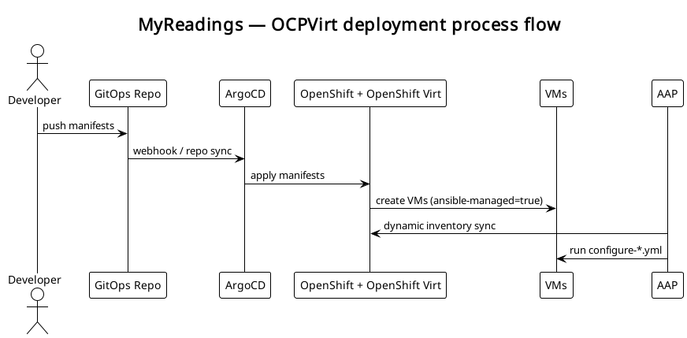
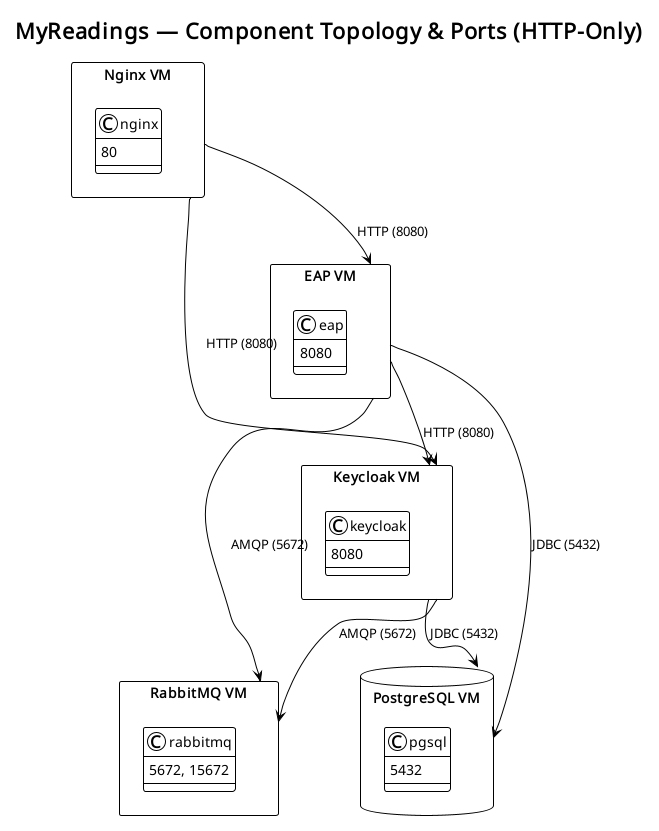

# MyReadings — OCP Virtualization Deployment

## Overview
This folder contains manifests, overlays, and automation playbooks to deploy the **MyReadings** application suite
on **OpenShift Virtualization** (OCPVirt) using a **GitOps-ready** approach.

Phase 1 focuses on **Infrastructure as Code (IaC)** — virtual machines, networking, and base configuration managed declaratively.
CI (build & artifact automation) will be introduced later.

---

## Components
| Component | Purpose | Ports | Depends on |
|------------|----------|--------|-------------|
| nginx-vm   | frontend UI | 80, 443 | backend (EAP), keycloak |
| eap-vm     | backend API | 8080, 9990 | keycloak, rabbitmq |
| keycloak-vm | auth service | 8080, 8443 | rabbitmq |
| rabbitmq-vm | messaging broker | 5672, 15672 | none |

---

## Folder Structure
- `base/` → Kustomize base definitions (VMs, Services, Routes, NetworkPolicies)
- `overlays/` → environment-specific patches (`dev`, `prod`)
<!-- - `infra-playbooks/` → Ansible playbooks run by AAP for Day-1 configuration -->

---

## GitOps flow

1. You push manifests to this repo (ArgoCD watches).
2. ArgoCD applies Kustomize overlays to create or update VirtualMachines.
3. Each VM is labeled:
   ```yaml
   metadata:
     labels:
       ansible-managed: "true"
       role: "<role>"
    ```
4. AAP’s dynamic inventory detects new VMs.
5. Corresponding playbooks (`configure-<role>.yml`) run via Job Templates.
6. Configuration happens only at first creation (checked via `/etc/ansible_configured` marker).

---

## Network Policies
Communication rules:
- frontend → backend, keycloak
- backend → keycloak, rabbitmq
- keycloak → rabbitmq
- rabbitmq → no outbound traffic
- SSH access only from AAP namespace
---

## Diagrams

### Process flow


### Component topology


## Notes
- VM initialization handled via cloud-init (installs OS packages, enables SSH).
- Configuration handled via AAP playbooks on VM creation.
- Networking governed by OpenShift NetworkPolicies.
- Everything Git-driven and GitOps-compatible.